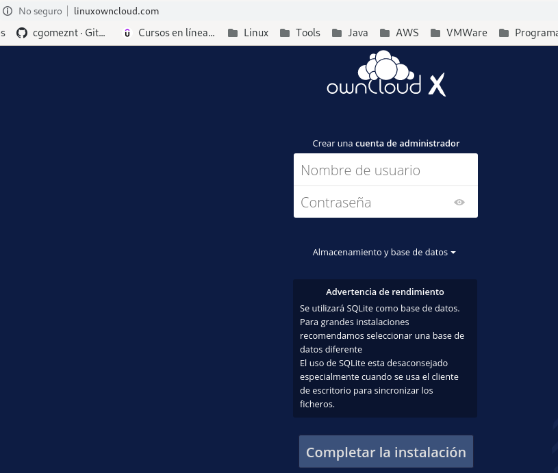
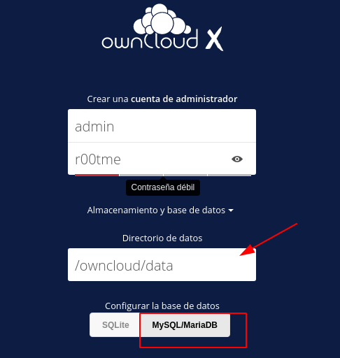
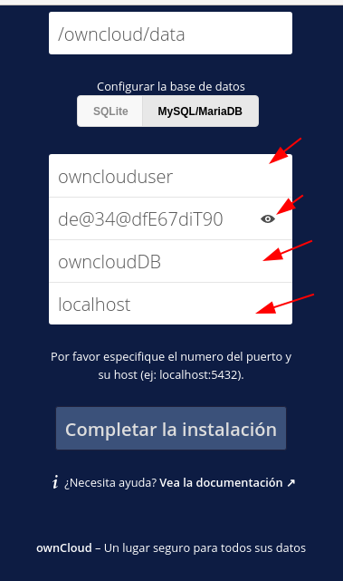
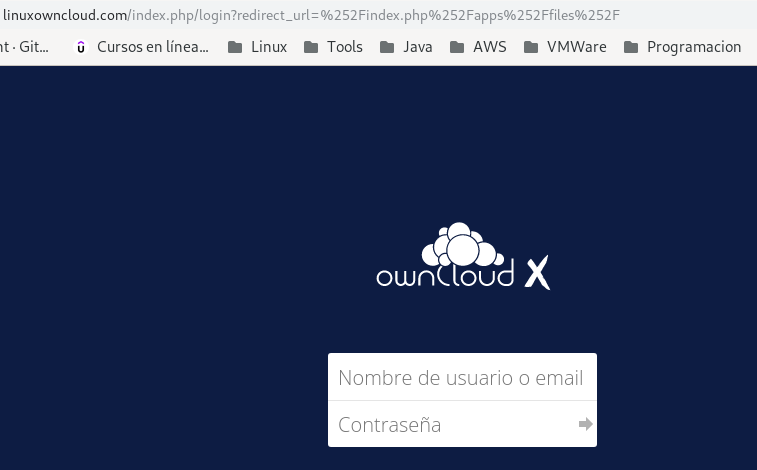
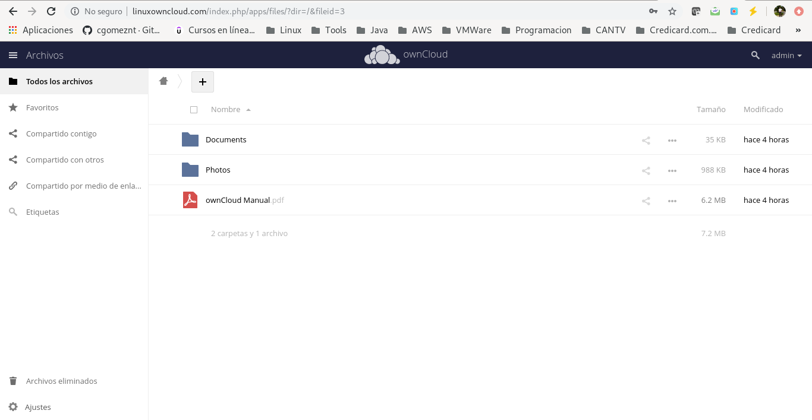

Instalar y configurare ownCloud en CentOS 7
============================================

OwnCloud es un software cliente-servidor popular para crear y utilizar servicios de alojamiento de archivos. Al usarlo, uno puede crear un servidor en la nube privada en lugar de depender de servicios pagos como Dropbox, OneDrive, pCloud, etc.

La ventaja significativa de utilizar ownCloud es el tamaño de la nube que obtiene. ¡Su tamaño está limitado por la capacidad de su disco duro! Con los discos duros tan asequibles en estos días, puede crear un servidor en la nube por valor de un terabyte a una fracción del costo en comparación con los servicios en la nube de pago.

Recuerde deshabilitar **selinux** y el **firewall**

Instalar y configurar Apache
++++++++++++++++++++++++
::

	# yum install httpd mod_ssl

	# systemctl status httpd
	● httpd.service - The Apache HTTP Server
	   Loaded: loaded (/usr/lib/systemd/system/httpd.service; disabled; vendor preset: disabled)
	   Active: inactive (dead)
	     Docs: man:httpd(8)
		   man:apachectl(8)

	# systemctl start httpd

Configurar repositorios **remi**
+++++++++++++++++++++++++++++++++

Estos repositorios los utilizamos para las ultimas versiones de PHP y MariaDB::

	# yum install http://rpms.remirepo.net/enterprise/remi-release-7.rpm

	# yum install yum-utils.noarch

	# yum-config-manager --disable remi-php54

	# yum-config-manager --enable remi-php72

	# yum install php php-mbstring php-gd php-mcrypt php-pear php-pspell php-pdo php-xml php-mysqlnd php-process php-pecl-zip php-xml php-intl php-zip php-zlib

	# yum --enablerepo=remi install mariadb-server

	# systemctl start mariadb.service

Verificamos el MariaDB::

	# netstat -natp | grep -i listen
	tcp        0      0 0.0.0.0:22              0.0.0.0:*               LISTEN      908/sshd            
	tcp        0      0 127.0.0.1:25            0.0.0.0:*               LISTEN      1004/master         
	tcp        0      0 0.0.0.0:3306            0.0.0.0:*               LISTEN      2264/mysqld         
	tcp6       0      0 :::22                   :::*                    LISTEN      908/sshd            
	tcp6       0      0 ::1:25                  :::*                    LISTEN      1004/master         
	tcp6       0      0 :::443                  :::*                    LISTEN      1286/httpd          
	tcp6       0      0 :::80                   :::*                    LISTEN      1286/httpd          

Terminamos la configuración del MariaDB::

	# mysql_secure_installation

	NOTE: RUNNING ALL PARTS OF THIS SCRIPT IS RECOMMENDED FOR ALL MariaDB
	      SERVERS IN PRODUCTION USE!  PLEASE READ EACH STEP CAREFULLY!

	In order to log into MariaDB to secure it, we'll need the current
	password for the root user.  If you've just installed MariaDB, and
	you haven't set the root password yet, the password will be blank,
	so you should just press enter here.

	Enter current password for root (enter for none): 
	OK, successfully used password, moving on...

	Setting the root password ensures that nobody can log into the MariaDB
	root user without the proper authorisation.

	Set root password? [Y/n] y
	New password: r00tme	
	Re-enter new password: r00tme 
	Password updated successfully!
	Reloading privilege tables..
	 ... Success!

	By default, a MariaDB installation has an anonymous user, allowing anyone
	to log into MariaDB without having to have a user account created for
	them.  This is intended only for testing, and to make the installation
	go a bit smoother.  You should remove them before moving into a
	production environment.

	Remove anonymous users? [Y/n] y
	 ... Success!

	Normally, root should only be allowed to connect from 'localhost'.  This
	ensures that someone cannot guess at the root password from the network.

	Disallow root login remotely? [Y/n] y
	 ... Success!

	By default, MariaDB comes with a database named 'test' that anyone can
	access.  This is also intended only for testing, and should be removed
	before moving into a production environment.

	Remove test database and access to it? [Y/n] y
	 - Dropping test database...
	 ... Success!
	 - Removing privileges on test database...
	 ... Success!

	Reloading the privilege tables will ensure that all changes made so far
	will take effect immediately.

	Reload privilege tables now? [Y/n] y
	 ... Success!

	Cleaning up...

	All done!  If you've completed all of the above steps, your MariaDB
	installation should now be secure.

	Thanks for using MariaDB!

Instalamos el OwnCloud
+++++++++++++++++++++++++++++
::

	# vi /etc/yum.repos.d/owncloud.repo

	[ce_10.1]
	name=wnCloud Server Version 10.1.x (CentOS_7)
	type=rpm-md
	baseurl=http://download.owncloud.org/download/repositories/production/CentOS_7
	gpgcheck=1
	gpgkey=http://download.owncloud.org/download/repositories/production/CentOS_7/repodata/repomd.xml.key
	enabled=1

Listamos los repositorios y hacemos un mantenimiento::

	# yum repolist
	# yum clean expire-cache

Instalamos el Owncloud::

# yum install owncloud

Creamos la Base de Datos para el Owncloud::

	# mysql -u root -p
	Enter password: r00tme
	Welcome to the MariaDB monitor.  Commands end with ; or \g.
	Your MariaDB connection id is 11
	Server version: 5.5.68-MariaDB MariaDB Server

	Copyright (c) 2000, 2018, Oracle, MariaDB Corporation Ab and others.

	Type 'help;' or '\h' for help. Type '\c' to clear the current input statement.

	MariaDB [(none)]> show databases;
	+--------------------+
	| Database           |
	+--------------------+
	| information_schema |
	| mysql              |
	| performance_schema |
	+--------------------+
	3 rows in set (0.00 sec)

Aquí creamos la Base de Datos::

	MariaDB [(none)]> create database owncloudDB;
	Query OK, 1 row affected (0.00 sec)

	MariaDB [(none)]> show databases;
	+--------------------+
	| Database           |
	+--------------------+
	| information_schema |
	| mysql              |
	| owncloudDB         |
	| performance_schema |
	+--------------------+
	4 rows in set (0.00 sec)

Creamos el usuario::

	MariaDB [(none)]> create user 'ownclouduser'@'localhost' identified BY 'de@34@dfE67diT90';

Le otorgamos privilegios::

	MariaDB [(none)]> grant all privileges on owncloudDB.* to ownclouduser@localhost ;

Limpiamos::

	MariaDB [(none)]> flush privileges;

	MariaDB [(none)]> quit

Configuramos el Apache para el Owncloud
++++++++++++++++++++++++++++++++++++++++
::

	# vi /etc/httpd/conf.d/owncloud.conf

	<VirtualHost *:80>
	ServerAdmin webmaster@linuxowncloud.com
	DocumentRoot "/var/www/html/owncloud/"
	ServerName linuxowncloud.com
	ServerAlias www.linuxowncloud.com

	ErrorLog "/var/log/httpd/linuxowncloud.com-error_log"
	CustomLog "/var/log/httpd/linuxowncloud.com-access_log" combined

	<Directory "/var/www/html/owncloud/">
	DirectoryIndex index.html index.php
	Options FollowSymLinks
	AllowOverride All
	Require all granted
	</Directory>

	#SSLEngine On

	#SSLCertificateFile /etc/ssl/certs/fosslinuxowncloud.cer
	#SSLCertificateKeyFile /etc/ssl/certs/fosslinuxowncloud.key
	#SSLCertificateChainFile /etc/ssl/certs/fosslinuxowncloud.ca

	</VirtualHost>

Reiniciamos el apache::

	# systemctl restart httpd

Creamos un directorio para tener toda la data en un FileSystem distinto:

	# mkdir -p /owncloud/data
	# chown -R apache.apache /owncloud/

Configuramos el Owncloud
++++++++++++++++++++++++++

