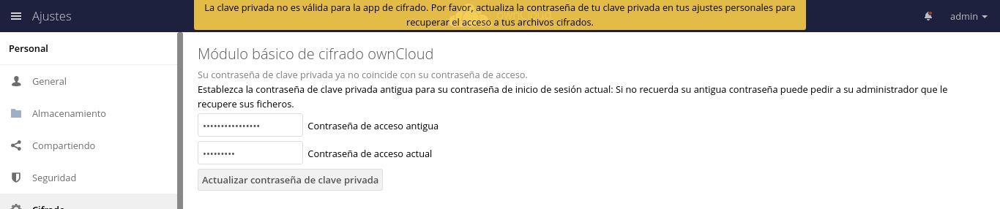

Cambiar password de usuario local
=================================

Ojo se puede perder la data...!!!::

	# sudo -u apache php occ user:resetpassword carlosgomez
	Warning: Resetting the password when using encryption will result in data loss!
	Do you want to continue?
	Enter a new password: 
	Confirm the new password: 
	Successfully reset password for carlosgomez

	# sudo -u apache php occ user:resetpassword admin
	Warning: Resetting the password when using encryption will result in data loss!
	Do you want to continue?
	Enter a new password: 
	Confirm the new password: 
	Successfully reset password for admin

.. figure:: ../images/cambiarclave/01.png

Si la persona no recuerda cual era su clave anterior se complica todo. Pero si sabe cual es su clave se debe ir a Go to Settings  Personal  Encryption

